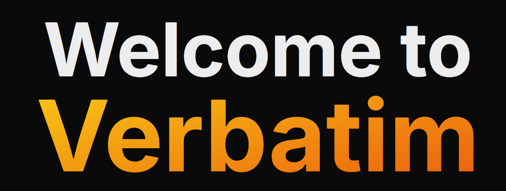
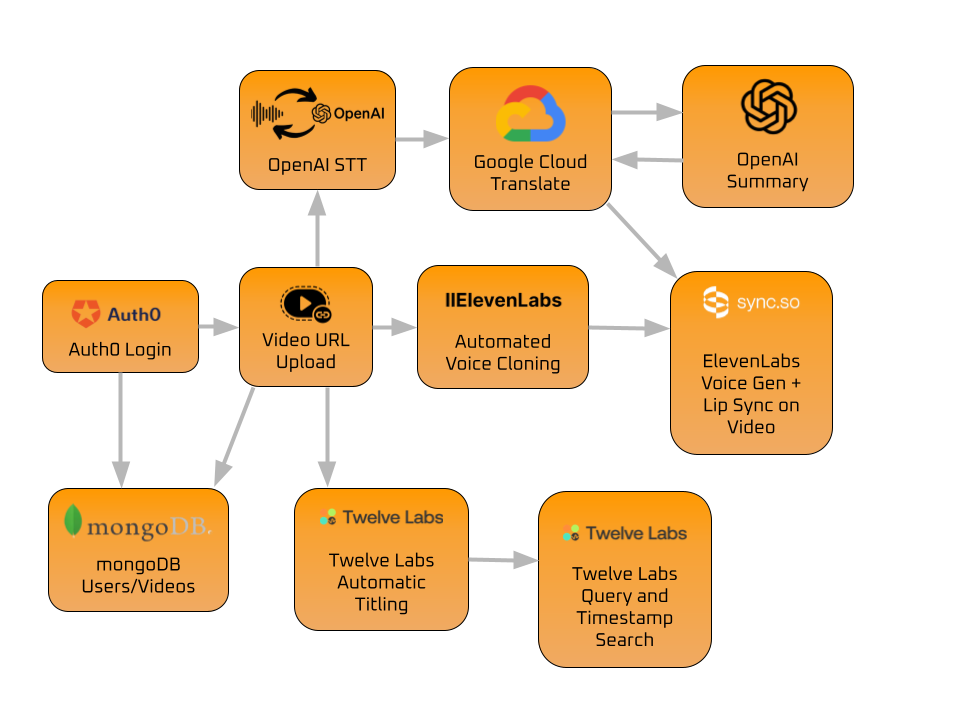

<!-- PROJECT LOGO -->
 

  <h1 align="center"><a href="https://www.getverbatim.tech/">Verbatim</a></h1>

  

    Dub, Discover, and Query any video in seconds!
     
    <a href="https://devpost.com/software/speakify-jg3nqf"><strong>Devpost »</strong></a>
     
     
    <a href="https://www.linkedin.com/in/chenhsonny/">Sonny Chen</a>
    ·
    <a href="https://www.linkedin.com/in/2023cyang/">Cindy Yang</a>
    ·
    <a href="https://www.linkedin.com/in/karthikthyagarajan06/">Karthik Thyagarajan</a> 
    ·
    <a href="https://www.linkedin.com/in/pranav-neti-a3870a243/">Pranav Neti</a> 
  

<!-- ABOUT THE PROJECT -->
## About The Project

Whether it’s educational lectures, news reports, or social media content, viewers often struggle with long-form videos in languages they don’t understand. Existing solutions offer subtitles, but they fail to capture the natural experience of watching a speaker.

**Our Solution**

Verbatim is an intelligent platform that takes any video, summarizes it for quicker consumption, translates it into multiple languages, and then recreates the speaker’s lip movements to match the new audio—delivering a seamless, localized experience.

### Built With

[![OpenAI][OpenAI]][OpenAI-url]
[![GoogleCloud][GoogleCloud]][GoogleCloud-url]
[![Auth0][Auth0]][Auth0-url]
[![MongoDB][MongoDB]][MongoDB-url]
[![Next.js][Next.js]][Next.js-url]
[![Tailwind CSS][Tailwind CSS]][Tailwind CSS-url]
[![Vercel][Vercel]][Vercel-url]

(<a href="#readme-top">back to top</a>)

<!-- GETTING STARTED -->
## Pipeline

### Speech-to-Text (STT) – OpenAI Whisper

Function: Converts spoken content from a video into a text transcript.

How It Works: Whisper is a multi-lingual, neural-network-based automatic speech recognition (ASR) system. It uses a large transformer model trained on diverse datasets to deliver accurate transcription across multiple languages.

### Translation – Google Cloud Translation API

Function: Translates the transcribed text into different languages.

How It Works: Uses Google’s neural machine translation (NMT) model to deliver fast, context-aware translations across 100+ languages.

### Summarization – OpenAI GPT

Function: Reduces long transcripts into concise summaries while preserving the main ideas.

How It Works: GPT models use transformer-based language models to analyze and compress long-form content into digestible summaries. You can fine-tune the length and detail of the summary.

### Lip-Sync Generation (Sync.so API):

Function: Animates a speaker’s face to match the translated and summarized text.

How It Works: Sync.so uses deep learning to generate realistic lip movements that match the audio. It can be used to create localized versions of videos in multiple languages.

### User Q&A Interface – TwelveLabs API

Function: Allows users to ask questions about the video content and receive context-aware responses.

How It Works: TwelveLabs stores vector embeddings of the video and speech in the video as context, allowing real-time semantic search and natural conversation.

## MLH Technologies

### MongoDB

MongoDB was used to store user data, video metadata, and generated content. It was also used to store the video transcript, summary, and translations.

### Auth0

Auth0 was used for user authentication and authorization. It was used to secure user data and ensure that only authenticated users could access the platform.

<!-- CONTACT -->
## Contact

Sonny Chen - chen5021@purdue.edu

Cindy Yang - cwyang@umich.edu

Karthik Thyagarajan - kthyagar@purdue.edu

Pranav Neti - pneti@purdue.edu

<!-- MARKDOWN LINKS & IMAGES -->
<!-- https://www.markdownguide.org/basic-syntax/#reference-style-links -->
[OpenAI]: https://img.shields.io/badge/OpenAI-412991?style=for-the-badge&logo=OpenAI&logoColor=white
[OpenAI-url]: https://openai.com/
[GoogleCloud]: https://img.shields.io/badge/Google_Cloud-4285F4?style=for-the-badge&logo=google-cloud&logoColor=white
[GoogleCloud-url]: https://cloud.google.com/
[Auth0]: https://img.shields.io/badge/Auth0-EB5424?style=for-the-badge&logo=auth0&logoColor=white
[Auth0-url]: https://auth0.com/
[MongoDB]: https://img.shields.io/badge/MongoDB-47A248?style=for-the-badge&logo=mongodb&logoColor=white
[MongoDB-url]: https://www.mongodb.com/
[Next.js]: https://img.shields.io/badge/Next.js-000000?style=for-the-badge&logo=next.js&logoColor=white
[Next.js-url]: https://nextjs.org/
[Tailwind CSS]: https://img.shields.io/badge/Tailwind_CSS-38B2AC?style=for-the-badge&logo=tailwind-css&logoColor=white
[Tailwind CSS-url]: https://tailwindcss.com/
[Vercel]: https://img.shields.io/badge/Vercel-000000?style=for-the-badge&logo=vercel&logoColor=white
[Vercel-url]: https://vercel.com/
